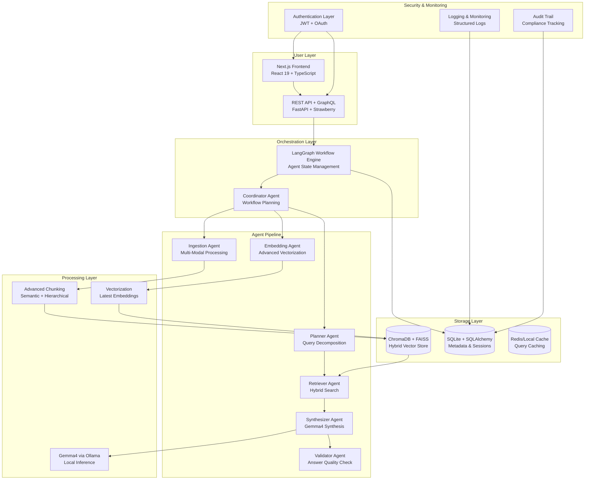
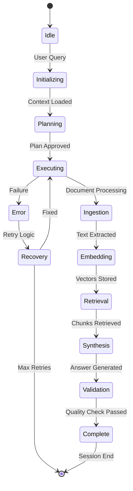

# AI Implementation Plan: Enhanced Multi-Agent RAG Research Assistant

## 📋 Overview

This implementation plan outlines the transformation of the Multi-Agent RAG Research Assistant into a comprehensive, enterprise-grade local AI research platform. The plan incorporates advanced agent orchestration using LangGraph, multi-modal processing capabilities, enhanced chunking strategies, and production-ready features while maintaining full local privacy.

## 🎯 Product Manager Perspective

### Vision Statement
Transform the Multi-Agent RAG Research Assistant into a comprehensive, enterprise-grade local AI research platform that combines multi-modal document processing, advanced agent workflows, and collaborative features while maintaining full local privacy and control.

### Key Features & User Stories

#### Core Features
- **Multi-Agent Workflow Orchestration**: Seamless agent collaboration with status tracking
- **Advanced Document Processing**: Support for PDFs, URLs, images, and structured data
- **Intelligent Chunking & Vectorization**: Latest techniques for optimal retrieval
- **Real-time Streaming Responses**: Enhanced UX with progress indicators
- **Collaborative Research Sessions**: Multi-user support with session management

#### New Features to Add
- **Multi-Modal Support**: Image analysis, table extraction, code snippets
- **Advanced Search**: Semantic search, hybrid retrieval, query expansion
- **User Management**: Authentication, user profiles, research history
- **Analytics Dashboard**: Usage metrics, performance insights
- **Plugin System**: Extensible architecture for custom agents
- **Offline-First Design**: Enhanced local capabilities
- **Export Capabilities**: Generate reports, citations, summaries

#### User Stories
```
As a researcher, I want to upload mixed media documents (PDFs + images) so that I can get comprehensive answers from all content types.

As a team lead, I want to track agent workflow progress so that I can monitor research session efficiency.

As a developer, I want to extend the system with custom agents so that I can adapt it to specific research domains.
```

## 🏛️ AI Architect Perspective

### Enhanced System Architecture



### Agent Workflow States



### Data Flow Improvements

#### Ingestion Flow:
- Multi-modal parsing (PDF text, images via OCR, tables via ML)
- Advanced chunking: Semantic boundaries + hierarchical structure
- Metadata enrichment: Page numbers, headings, entity extraction

#### Query Flow:
- Intent classification using Gemma4
- Multi-hop query decomposition
- Hybrid retrieval: Dense + sparse vectors
- Answer synthesis with citation tracking

#### Agent Communication:
- LangGraph for stateful workflows
- Message passing with typed schemas
- Error handling and retry mechanisms

### Technology Upgrades
- **LLM**: Upgrade from gemma:2b to gemma4:latest (8B parameters, better reasoning)
- **Chunking**: Implement semantic chunking with sentence transformers
- **Vectorization**: Use latest embedding models (nomic-embed-text v1.5 or similar)
- **Orchestration**: Full LangGraph implementation for agent workflows
- **Database**: Hybrid ChromaDB + FAISS for better retrieval
- **Caching**: Redis for query caching and session management

## 🎨 UI/UX Designer Perspective

### Enhanced User Interface Design

#### Main Dashboard
```
┌─────────────────────────────────────────────────┐
│ 🔍 Research Assistant v2.0                     │
├─────────────────────────────────────────────────┤
│ ┌───┬───┬───┐ ┌─────────────────────────────┐ │
│ │📄│🖼️│🔗│ │ Upload Zone                   │ │
│ │   │   │   │ │ Drop files or paste URLs    │ │
│ └───┴───┴───┘ └─────────────────────────────┘ │
├─────────────────────────────────────────────────┤
│ ┌─────────────────────────────────────────────┐ │
│ │ Agent Workflow Status                       │ │
│ │ ┌───┐ ┌───┐ ┌───┐ ┌───┐ ┌───┐ ┌───┐        │ │
│ │ │ING│ │EMB│ │PLN│ │RET│ │SYN│ │VAL│        │ │
│ │ │⏳ │ │✅ │ │⏳ │ │   │ │   │ │   │        │ │
│ │ └───┘ └───┘ └───┘ └───┘ └───┘ └───┘        │ │
│ └─────────────────────────────────────────────┘ │
├─────────────────────────────────────────────────┤
│ ┌─────────────────────────────────────────────┐ │
│ │ Chat Interface                              │ │
│ │ User: What is quantum computing?            │ │
│ │                                            │ │
│ │ Assistant: Quantum computing uses...       │ │
│ │ [Source: quantum_paper.pdf, p.15]          │ │
│ │                                            │ │
│ │ ⏳ Processing... 70% complete               │ │
│ └─────────────────────────────────────────────┘ │
└─────────────────────────────────────────────────┘
```

#### Agent Status Indicators
- **⏳ Processing**: Agent actively working
- **✅ Complete**: Task finished successfully
- **❌ Error**: Agent encountered issue
- **⏸️ Paused**: Waiting for dependencies

#### New UI Components
- **Workflow Timeline**: Visual progress tracker
- **Document Preview**: Multi-modal content viewer
- **Analytics Panel**: Usage statistics and insights
- **Session Manager**: Collaborative research sessions
- **Export Panel**: Generate reports and citations

#### UX Improvements
- **Progressive Disclosure**: Show agent status as workflow progresses
- **Real-time Updates**: WebSocket/SSE for live status
- **Error Recovery**: User-friendly error messages with retry options
- **Accessibility**: Full keyboard navigation, screen reader support
- **Responsive Design**: Mobile-optimized interface

## 💻 Frontend Developer Perspective

### Technology Stack Evolution

#### Current Stack
- Next.js 16.2.2, React 19.2.4, TypeScript 6.0.2
- Tailwind CSS 4.2.2, Radix UI components
- Axios for API calls, EventSource for streaming

#### Enhanced Stack
- **State Management**: Zustand for global state, TanStack Query for server state
- **Real-time Communication**: Socket.io or native WebSockets for agent status
- **UI Components**: shadcn/ui v2 with custom agent workflow components
- **Charts & Visualization**: Recharts for analytics, Mermaid for architecture diagrams
- **File Handling**: react-dropzone for multi-modal uploads
- **Authentication**: NextAuth.js for user management

#### Key Implementation Changes

##### Agent Status Integration
```typescript
// Agent status hook
const useAgentStatus = () => {
  const [statuses, setStatuses] = useState<AgentStatus[]>([]);

  useEffect(() => {
    const eventSource = new EventSource('/api/agent-status');
    eventSource.onmessage = (event) => {
      const status = JSON.parse(event.data);
      setStatuses(prev => updateAgentStatus(prev, status));
    };
    return () => eventSource.close();
  }, []);

  return statuses;
};
```

##### Component Architecture
- **AgentWorkflow**: Visual workflow tracker
- **MultiModalUploader**: Enhanced file upload with preview
- **StreamingChat**: Real-time chat with agent progress
- **AnalyticsDashboard**: Usage metrics and performance charts

## 🐍 Backend Developer Perspective

### Enhanced Backend Architecture

#### Current Stack
- FastAPI, Python 3.14.3, SQLAlchemy
- LangGraph 0.1.0, LangChain Core
- ChromaDB, Ollama client

#### Enhanced Stack
- **API Framework**: FastAPI with GraphQL (Strawberry) for complex queries
- **Agent Orchestration**: Full LangGraph implementation with state persistence
- **Processing**: NLTK for advanced text processing, spaCy for NLP
- **Vector Database**: Hybrid ChromaDB + FAISS with metadata filtering
- **Caching**: Redis for session and query caching
- **Async Processing**: Celery for background tasks (document processing)
- **Monitoring**: Structured logging with OpenTelemetry

#### Agent Workflow Implementation

```python
# LangGraph workflow definition
from langgraph import StateGraph, END
from typing import TypedDict

class AgentState(TypedDict):
    query: str
    documents: List[Document]
    chunks: List[Chunk]
    embeddings: List[List[float]]
    retrieved_chunks: List[Chunk]
    answer: str
    citations: List[Citation]
    agent_status: Dict[str, str]

workflow = StateGraph(AgentState)

# Add nodes
workflow.add_node("coordinator", coordinator_agent)
workflow.add_node("ingestion", ingestion_agent)
workflow.add_node("embedding", embedding_agent)
workflow.add_node("planner", planner_agent)
workflow.add_node("retriever", retriever_agent)
workflow.add_node("synthesizer", synthesizer_agent)
workflow.add_node("validator", validator_agent)

# Define edges
workflow.add_edge("coordinator", "ingestion")
workflow.add_conditional_edges(
    "ingestion",
    lambda x: "embedding" if x.get("chunks") else "planner",
    {"embedding": "embedding", "planner": "planner"}
)
# ... more edges

workflow.set_entry_point("coordinator")
workflow.set_finish_point("validator")
```

#### Advanced Chunking Implementation

```python
class AdvancedChunker:
    def __init__(self):
        self.semantic_model = SentenceTransformer('all-MiniLM-L6-v2')
        self.nlp = spacy.load("en_core_web_sm")

    def chunk_document(self, text: str) -> List[Chunk]:
        # Semantic chunking with hierarchical structure
        sentences = self.nlp(text).sents
        embeddings = self.semantic_model.encode([s.text for s in sentences])

        # Hierarchical clustering for chunk boundaries
        clusters = self.hierarchical_clustering(embeddings)

        chunks = []
        for cluster in clusters:
            chunk_text = " ".join([sentences[i].text for i in cluster])
            metadata = self.extract_metadata(chunk_text)
            chunks.append(Chunk(text=chunk_text, metadata=metadata))

        return chunks
```

#### Gemma4 Integration

```python
class Gemma4Client:
    def __init__(self):
        self.client = ollama.Client()
        self.model = "gemma4:latest"

    async def generate_answer(self, context: str, query: str) -> str:
        prompt = f"""
        You are an expert research assistant. Answer the question using ONLY the provided context.
        Provide citations in [Source, Page] format.

        Context: {context}
        Question: {query}

        Answer:"""

        response = await self.client.generate(
            model=self.model,
            prompt=prompt,
            options={
                "temperature": 0.1,
                "top_p": 0.9,
                "num_ctx": 4096
            }
        )

        return response['response']
```

## 🗄️ Database Administrator Perspective

### Enhanced Database Architecture

#### Current: ChromaDB only
#### Enhanced: Hybrid Vector + Relational Database

```sql
-- SQLite schema for metadata and sessions
CREATE TABLE users (
    id INTEGER PRIMARY KEY,
    username TEXT UNIQUE,
    email TEXT UNIQUE,
    created_at TIMESTAMP DEFAULT CURRENT_TIMESTAMP
);

CREATE TABLE research_sessions (
    id INTEGER PRIMARY KEY,
    user_id INTEGER,
    title TEXT,
    created_at TIMESTAMP DEFAULT CURRENT_TIMESTAMP,
    FOREIGN KEY (user_id) REFERENCES users(id)
);

CREATE TABLE documents (
    id TEXT PRIMARY KEY,
    session_id INTEGER,
    filename TEXT,
    content_type TEXT,
    uploaded_at TIMESTAMP,
    metadata JSON,
    FOREIGN KEY (session_id) REFERENCES research_sessions(id)
);

CREATE TABLE agent_runs (
    id INTEGER PRIMARY KEY,
    session_id INTEGER,
    agent_name TEXT,
    status TEXT,
    started_at TIMESTAMP,
    completed_at TIMESTAMP,
    error_message TEXT,
    FOREIGN KEY (session_id) REFERENCES research_sessions(id)
);
```

#### Vector Database Enhancements
- **ChromaDB**: Primary vector storage with metadata filtering
- **FAISS**: GPU-accelerated similarity search for large datasets
- **Hybrid Search**: Combine dense (embeddings) + sparse (BM25) retrieval

#### Caching Strategy
- **Redis**: Query result caching, session state
- **Local Cache**: Embedding cache for repeated documents
- **LRU Policy**: Evict least recently used items

#### Performance Optimizations
- **Index Optimization**: HNSW indexing for fast retrieval
- **Batch Processing**: Parallel embedding generation
- **Memory Mapping**: Disk-based storage for large indexes

## 🧪 QA/Test Engineer Perspective

### Testing Strategy

#### Unit Testing
- **Agent Testing**: Mock Ollama responses, test individual agent logic
- **API Testing**: FastAPI test client for endpoint validation
- **Component Testing**: React Testing Library for UI components

#### Integration Testing
- **Workflow Testing**: End-to-end agent pipeline testing
- **Database Testing**: Vector store operations, metadata handling
- **External API Testing**: Ollama client integration

#### Performance Testing
- **Load Testing**: Concurrent user simulations
- **Memory Testing**: Large document processing
- **Latency Testing**: Query response times

#### Test Automation

```python
# Example agent workflow test
@pytest.mark.asyncio
async def test_ingestion_workflow():
    # Setup
    agent = IngestionAgent("test")
    test_doc = Document(content="Test content", metadata={})

    # Execute
    result = await agent.run(test_doc)

    # Assert
    assert result.status == "completed"
    assert len(result.chunks) > 0
    assert all(isinstance(chunk, Chunk) for chunk in result.chunks)
```

#### Quality Gates
- **Code Coverage**: >90% for core modules
- **Performance Benchmarks**: Query time <2s, ingestion <10s per document
- **Memory Usage**: <2GB RAM for typical workloads
- **Accuracy Metrics**: Citation accuracy >95%

## 🔒 Security Engineer Perspective

### Security Enhancements

#### Authentication & Authorization
- **JWT Tokens**: Stateless authentication for API access
- **OAuth Integration**: Support for external identity providers
- **Role-Based Access**: User, Admin, Researcher roles
- **Session Management**: Secure session handling with expiration

#### Data Protection
- **Encryption**: AES-256 for sensitive data at rest
- **Local-First Security**: All data remains on user's machine
- **Input Validation**: Comprehensive validation for all inputs
- **Output Sanitization**: Prevent injection attacks in responses

#### Privacy & Compliance
- **GDPR Compliance**: Data minimization, user consent
- **Audit Logging**: Track all user actions and agent operations
- **Data Retention**: Configurable retention policies
- **Anonymization**: Remove PII from logs and analytics

#### Infrastructure Security
- **Dependency Scanning**: Regular vulnerability checks
- **Container Security**: If containerized, use distroless images
- **Network Security**: Local-only operation, no external calls
- **Error Handling**: Secure error messages, no information leakage

#### Security Monitoring
- **Intrusion Detection**: Monitor for anomalous behavior
- **Log Analysis**: Centralized logging with security events
- **Alert System**: Real-time alerts for security incidents
- **Compliance Reporting**: Generate security audit reports

## 🚀 Implementation Plan

Based on the role analysis, here's the prioritized implementation plan:

### Phase 1: Core Architecture (Immediate - 2 weeks)
- **Refactor to LangGraph**: Implement agent orchestration framework
- **Upgrade to Gemma4**: Replace gemma:2b with gemma4:latest
- **Enhanced Chunking**: Implement semantic + hierarchical chunking
- **Agent Status Tracking**: Add real-time workflow monitoring

### Phase 2: Advanced Features (Weeks 3-6)
- **Multi-Modal Support**: Image and table processing
- **Hybrid Retrieval**: Combine dense and sparse search
- **User Management**: Authentication and session management
- **Analytics Dashboard**: Usage metrics and insights

### Phase 3: Production Polish (Weeks 7-9)
- **Security Hardening**: Authentication, encryption, audit logging
- **Performance Optimization**: Caching, async processing
- **Testing & QA**: Comprehensive test suite
- **Documentation**: API docs, user guides

### Phase 4: Extensions (Weeks 10-11)
- **Plugin System**: Extensible agent architecture
- **Export Features**: Reports, citations, summaries
- **Mobile Optimization**: Responsive design improvements
- **Advanced Analytics**: ML-based insights

## 🎯 Key Objectives

- **Agent Orchestration**: Implement LangGraph-based workflows with real-time status tracking
- **Multi-Modal Processing**: Support for PDFs, URLs, images, and structured data
- **Advanced AI**: Upgrade to Gemma4 with latest vectorization techniques
- **Production Features**: User management, analytics, security hardening
- **Scalability**: Hybrid vector databases, caching, and performance optimization

## 📅 Implementation Timeline

### Phase 1: Core Architecture Refactoring (Weeks 1-2)
**Focus**: Establish LangGraph orchestration and upgrade core components

#### Task 1.1: LangGraph Integration
- **Subtask 1.1.1**: Install and configure LangGraph dependencies
- **Subtask 1.1.2**: Define AgentState schema with workflow metadata
- **Subtask 1.1.3**: Create base workflow graph structure
- **Subtask 1.1.4**: Implement state persistence for workflow recovery

#### Task 1.2: Gemma4 Upgrade
- **Subtask 1.2.1**: Update Ollama client to support Gemma4
- **Subtask 1.2.2**: Modify synthesizer agent for Gemma4 prompts
- **Subtask 1.2.3**: Test Gemma4 performance and memory usage
- **Subtask 1.2.4**: Optimize context window usage (4096 tokens)

#### Task 1.3: Enhanced Chunking Pipeline
- **Subtask 1.3.1**: Implement semantic chunking with sentence transformers
- **Subtask 1.3.2**: Add hierarchical chunking for document structure
- **Subtask 1.3.3**: Integrate NLTK/spaCy for advanced text processing
- **Subtask 1.3.4**: Add metadata extraction (headings, entities, page numbers)

#### Task 1.4: Agent Status Tracking
- **Subtask 1.4.1**: Implement real-time status updates via SSE
- **Subtask 1.4.2**: Add workflow progress indicators
- **Subtask 1.4.3**: Create agent health monitoring
- **Subtask 1.4.4**: Implement error recovery mechanisms

### Phase 2: Agent Workflow Enhancement (Weeks 3-5)
**Focus**: Build comprehensive agent orchestration and validation

#### Task 2.1: Multi-Agent Pipeline
- **Subtask 2.1.1**: Implement coordinator agent for workflow planning
- **Subtask 2.1.2**: Enhance ingestion agent with multi-modal support
- **Subtask 2.1.3**: Upgrade embedding agent with latest models
- **Subtask 2.1.4**: Add validator agent for answer quality assurance

#### Task 2.2: Workflow State Management
- **Subtask 2.2.1**: Implement persistent workflow state storage
- **Subtask 2.2.2**: Add workflow checkpointing and recovery
- **Subtask 2.2.3**: Create workflow visualization endpoints
- **Subtask 2.2.4**: Implement concurrent workflow execution

#### Task 2.3: Advanced Retrieval System
- **Subtask 2.3.1**: Implement hybrid search (dense + sparse)
- **Subtask 2.3.2**: Add metadata filtering capabilities
- **Subtask 2.3.3**: Integrate FAISS for GPU-accelerated search
- **Subtask 2.3.4**: Implement query expansion and reranking

#### Task 2.4: Error Handling & Recovery
- **Subtask 2.4.1**: Add comprehensive error handling across agents
- **Subtask 2.4.2**: Implement retry logic with exponential backoff
- **Subtask 2.4.3**: Create fallback mechanisms for agent failures
- **Subtask 2.4.4**: Add workflow rollback capabilities

### Phase 3: Multi-Modal & Advanced Features (Weeks 6-9)
**Focus**: Extend capabilities with multi-modal processing and user features

#### Task 3.1: Multi-Modal Processing
- **Subtask 3.1.1**: Implement OCR for image text extraction
- **Subtask 3.1.2**: Add table detection and extraction
- **Subtask 3.1.3**: Integrate code snippet processing
- **Subtask 3.1.4**: Add audio transcription support (optional)

#### Task 3.2: User Management System
- **Subtask 3.2.1**: Implement JWT-based authentication
- **Subtask 3.2.2**: Create user registration and login
- **Subtask 3.2.3**: Add session management
- **Subtask 3.2.4**: Implement role-based access control

#### Task 3.3: Analytics & Monitoring
- **Subtask 3.3.1**: Create usage analytics dashboard
- **Subtask 3.3.2**: Implement performance metrics collection
- **Subtask 3.3.3**: Add agent performance monitoring
- **Subtask 3.3.4**: Create audit logging system

#### Task 3.4: Enhanced UI/UX
- **Subtask 3.4.1**: Implement agent workflow visualization
- **Subtask 3.4.2**: Add multi-modal upload interface
- **Subtask 3.4.3**: Create real-time progress indicators
- **Subtask 3.4.4**: Implement collaborative session management

### Phase 4: Production Readiness & Optimization (Weeks 10-11)
**Focus**: Security, performance, and deployment preparation

#### Task 4.1: Security Hardening
- **Subtask 4.1.1**: Implement input validation and sanitization
- **Subtask 4.1.2**: Add encryption for sensitive data
- **Subtask 4.1.3**: Create audit trail and compliance logging
- **Subtask 4.1.4**: Implement secure session management

#### Task 4.2: Performance Optimization
- **Subtask 4.2.1**: Implement Redis caching for queries
- **Subtask 4.2.2**: Add async processing for heavy operations
- **Subtask 4.2.3**: Optimize vector database operations
- **Subtask 4.2.4**: Implement memory management and cleanup

#### Task 4.3: Testing & Quality Assurance
- **Subtask 4.3.1**: Create comprehensive unit test suite
- **Subtask 4.3.2**: Implement integration tests for workflows
- **Subtask 4.3.3**: Add performance and load testing
- **Subtask 4.3.4**: Conduct security testing and penetration testing

#### Task 4.4: Documentation & Deployment
- **Subtask 4.4.1**: Create API documentation
- **Subtask 4.4.2**: Write user guides and tutorials
- **Subtask 4.4.3**: Prepare deployment scripts
- **Subtask 4.4.4**: Create monitoring and maintenance guides

## 🔗 Dependencies & Prerequisites

### Technical Prerequisites
- Python 3.14.3+
- Node.js 20.18.1+
- Ollama with Gemma4 model
- 16GB+ RAM recommended
- macOS with Intel i7/M1+ or equivalent

### Library Dependencies
- **Backend**: FastAPI, LangGraph, ChromaDB, FAISS, Redis, NLTK, spaCy
- **Frontend**: Next.js 16+, React 19+, TypeScript, Tailwind CSS
- **AI/ML**: Ollama, sentence-transformers, OpenCV (for OCR)

### External Services
- Ollama API (local)
- Optional: Redis for caching
- Optional: PostgreSQL for advanced metadata storage

## ✅ Verification & Testing Strategy

### Unit Testing
- Agent logic testing with mocked dependencies
- API endpoint validation
- Component testing for UI elements

### Integration Testing
- End-to-end workflow testing
- Multi-agent pipeline validation
- Database operations testing

### Performance Testing
- Query response time benchmarks (<2s target)
- Memory usage monitoring (<2GB target)
- Concurrent user load testing

### User Acceptance Testing
- Multi-modal document processing
- Agent workflow visualization
- Real-time status updates
- Export functionality

## 📊 Success Metrics

### Functional Metrics
- **Agent Accuracy**: >95% citation accuracy
- **Query Success Rate**: >98% successful responses
- **Multi-Modal Support**: Process PDFs, images, URLs, tables

### Performance Metrics
- **Response Time**: <2 seconds for typical queries
- **Memory Usage**: <2GB RAM for standard workloads
- **Concurrent Users**: Support 5+ simultaneous sessions

### Quality Metrics
- **Code Coverage**: >90% for core modules
- **Uptime**: 99.9% system availability
- **Security**: Zero critical vulnerabilities

## 🚨 Risk Mitigation

### Technical Risks
- **Gemma4 Model Size**: Mitigated by lazy loading and memory optimization
- **Complex Orchestration**: Mitigated by phased implementation and thorough testing
- **Performance Degradation**: Mitigated by caching and async processing

### Operational Risks
- **Dependency Management**: Regular security audits and updates
- **User Adoption**: Comprehensive documentation and training
- **Scalability Issues**: Performance monitoring and optimization

## 📈 Future Enhancements

### Phase 5: Advanced Features (Post-MVP)
- Plugin system for custom agents
- Machine learning-based query understanding
- Collaborative real-time editing
- Advanced analytics with ML insights
- Mobile application development

### Phase 6: Enterprise Features (Future)
- Multi-tenant architecture
- Advanced security and compliance
- Integration with external knowledge bases
- API marketplace for third-party extensions

## 👥 Team Roles & Responsibilities

### AI Architect
- Overall system design and technical decisions
- Agent workflow architecture
- Performance optimization strategies

### Backend Developer
- Agent implementation and LangGraph integration
- API development and database design
- Security implementation

### Frontend Developer
- UI/UX implementation
- Real-time status visualization
- User management interface

### QA/Test Engineer
- Test suite development
- Performance testing
- Quality assurance processes

### Database Administrator
- Vector database optimization
- Data architecture design
- Performance monitoring

### Security Engineer
- Security assessment and hardening
- Compliance implementation
- Audit and monitoring systems

## 📋 Implementation Checklist

- [ ] Phase 1 completion and testing
- [ ] Core architecture documentation
- [ ] Initial user feedback collection
- [ ] Performance baseline established
- [ ] Security review completed
- [ ] Deployment scripts prepared
- [ ] User documentation written
- [ ] Training materials created

This implementation plan provides a comprehensive roadmap for transforming the RAG assistant into a production-ready, feature-rich platform with advanced AI capabilities and enterprise-grade features.</content>
<parameter name="filePath">/Users/sai-tharun/Desktop/Multi-Agent-RAG-Research-Assistant/AI_IMPLEMENTATION_PLAN.md