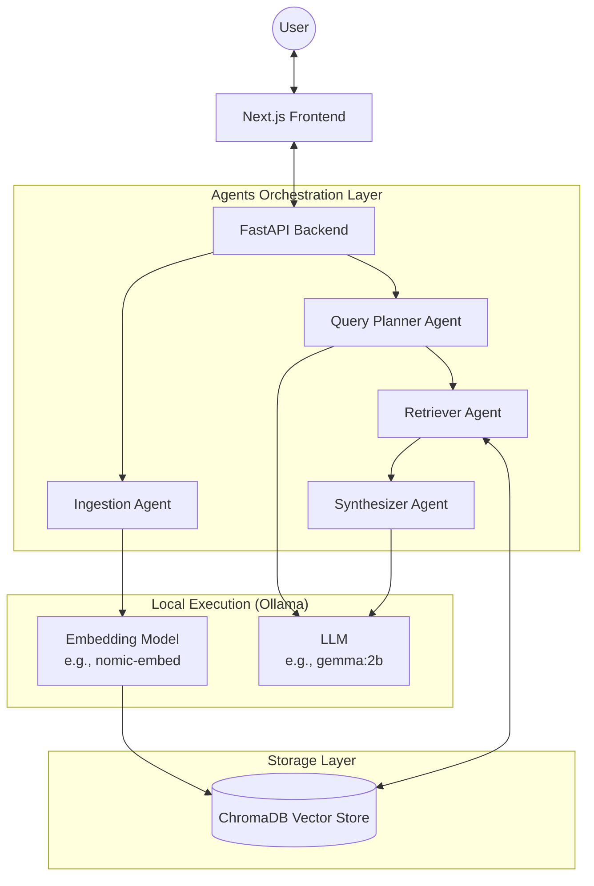

# Multi-Agent RAG Research Assistant Plan

A fully local, modular, and scalable multi-agent RAG system for document and URL questioning.

## User Review Required

> [!IMPORTANT]
> Please review the chosen local LLM models and vector DB. I've suggested `Ollama` with the `gemma:2b` or `llama3:8b` model for synthesis and `mxbai-embed-large` or `nomic-embed-text` for embeddings to fit comfortably within the 16GB RAM constraint.
> For the Vector DB, I've selected `ChromaDB` as it runs natively within Python and requires zero standalone server setup, which is ideal for a local-first system.

## Proposed System Architecture

### 1. High-Level Architecture Diagram



### 2. Detailed Data Flow

**Ingestion Flow:**
1. User uploads PDF or enters URL via UI.
2. Frontend sends file/URL to `/upload` endpoint.
3. Ingestion Agent extracts text (PyMuPDF for PDFs, BeautifulSoup for URLs).
4. Text is cleaned and split using semantic + recursive chunking.
5. Embedding Agent batches chunks and sends to Ollama embedding model.
6. Chunks, metadata (source, page, chunk_id), and embeddings are stored in Vector DB.

**Query Flow:**
1. User submits query to `/query` endpoint.
2. Query Planner Agent analyzes and breaks the query into sub-queries if multi-hop reasoning is needed (e.g., matching broad vs deep search).
3. Retriever Agent performs similarity (or hybrid) search in Vector DB for each sub-query.
4. Top-K relevant chunks are fetched.
5. Synthesizer Agent receives chunks + query, passes to Ollama LLM with a strict prompt to cite sources.
6. Synthesizer streams the grounded response back to UI.

### 3. Folder Structure

```text
multi-agent-rag/
├── backend/
│   ├── main.py                 # FastAPI entry point
│   ├── api/
│   │   ├── routes.py           # /upload, /query, /documents endpoints
│   │   ├── schemas.py          # Pydantic models (request/response)
│   ├── agents/
│   │   ├── base.py             # Agent interfaces
│   │   ├── ingestion.py        # PDF/URL parsing & chunking
│   │   ├── planner.py          # Query decomposition
│   │   ├── retriever.py        # Vector search logic
│   │   └── synthesizer.py      # Final answer generation
│   ├── core/
│   │   ├── config.py           # Env vars, model configs
│   │   ├── ollama_client.py    # Wrapper for Ollama API
│   │   └── prompts.py          # Prompt templates
│   ├── db/
│   │   └── vector_store.py     # Chroma / FAISS wrapper
│   └── requirements.txt
├── frontend/
│   ├── package.json
│   ├── src/
│   │   ├── app/                # Next.js App Router (page.tsx, layout.tsx)
│   │   ├── components/
│   │   │   ├── ui/             # shadcn/ui components
│   │   │   ├── Chat.tsx        # Chat interface
│   │   │   └── Upload.tsx      # Document upload widget
│   │   └── lib/                # API client, utils
│   └── tailwind.config.ts
└── README.md                   # Project instructions
```

### 4. API Design (FastAPI)

- `POST /upload`
  - **Req:** `multipart/form-data` (file) or `{"url": "https..."}`
  - **Res:** `{"doc_id": "uuid", "chunks_processed": 42, "status": "success"}`

- `POST /process`
  - **Req:** `{"doc_id": "uuid", "strategy": "semantic"}`
  - **Res:** `{"status": "indexing_complete"}`

- `POST /query`
  - **Req:** `{"query": "What is...", "stream": true}`
  - **Res:** Server-Sent Events (SSE) stream or `{"answer": "...", "citations": [{"source": "A", "page": 2}]}`

- `GET /documents`
  - **Res:** `[{"doc_id": "uuid", "name": "paper.pdf", "uploaded_at": "date"}]`

- `DELETE /delete/{doc_id}`
  - **Res:** `{"status": "deleted"}`

### 5. Suggested Libraries / Modules

- **Backend:** `fastapi`, `uvicorn`, `langgraph` (recommended for predictable agent routing) or `langchain`, `chromadb` (Vector DB), `PyMuPDF` (PDFs), `beautifulsoup4` (URLs).
- **Frontend:** `next` (React), `tailwindcss`, `shadcn-ui`, `lucide-react` (icons).
- **Local AI:** `ollama` (requires Ollama App installed on Mac).

### 6. Development Roadmap

- **Phase 1: Foundation (Local Setup)**
  - Scaffold Next.js frontend and FastAPI backend.
  - Install Ollama, pull lightweight models (`gemma:2b`, `nomic-embed-text`).
- **Phase 2: Ingestion & Vector DB**
  - Implement PDF/URL parsing and text chunking.
  - Hook up Vector DB (Chroma/FAISS).
  - Implement `/upload` API.
- **Phase 3: Agent Orchestration**
  - Build Query Planner, Retriever, and Synthesizer.
  - Define inter-agent communication (message passing).
  - Implement `/query` API with basic single-shot retrieval.
- **Phase 4: Advanced Features & Streaming**
  - Enable SSE streaming for real-time text generation.
  - Implement multi-hop query decomposition.
  - Implement strict citation formatting in Synthesizer prompts.
- **Phase 5: UI Integration & Optimization**
  - Build Chat UI, Document Manager UI in Next.js.
  - Implement query caching (e.g., simple in-memory LRU cache or Redis).

### 7. Performance Optimization Tips (Mac Intel i7, 16GB RAM)

> [!TIP]
> - **Model Selection:** Avoid large models (like 70B parameters). Stick to 2B-8B parameter models quantized at 4-bit (Ollama handles this). `gemma:2b` or `llama3:8b` are excellent. For embeddings, `nomic-embed-text` or `all-minilm` are extremely fast on Intel CPUs.
> - **Chunking Strategy:** Use smaller chunk sizes (e.g., 500 tokens) with 50-token overlap to reduce the context window burden preventing the LLM from taking too long to synthesize answers.
> - **Concurrency Control:** Process embeddings sequentially or in small batches to prevent CPU throttling and RAM exhaustion on older Intel chips.
> - **Memory Mapping:** Vector DBs like FAISS or Chroma should be configured to maintain index on-disk/memory-mapped if index grows large.

### 8. Prompt Engineering Strategy

**Query Decomposition Prompt (Query Planner):**
```text
You are an expert search planner. Given a user query, break it down into 1-3 simple, atomic sub-queries needed to fully answer the question.
User Query: {query}
Output as a JSON list of strings.
```

**Synthesizer Prompt:**
```text
Answer the user's question using ONLY the provided retrieved context. 
If the context does not contain the answer, say "I don't know based on the provided documents".
For every fact, you MUST include an inline citation formatted as [Source Name, Page X].
Context: {context}
Question: {query}
```

## Open Questions

> [!WARNING]
> 1. Would you prefer to use an agent framework like `LangGraph` for strict, graph-based workflow routing, or do you prefer a more custom, lightweight message-passing implementation in pure Python?
> 2. Do you have a strict preference between `ChromaDB` (easier local setup, SQL+Vector) and `FAISS` (slightly more manual, pure dense vector search)? Both work fully offline.

## Verification Plan

### Automated Tests
- Test PDF extraction and web scraper logic using dummy documents.
- Test endpoint responses using Pytest (`pytest backend/tests/`).

### Manual Verification
- Upload a standard multi-page PDF via the UI, monitor RAM usage during indexing.
- Issue a complex multi-hop question. Ensure the Planner breaks it down, the Retriever fetches relevant chunks, and the Synthesizer outputs a streamed response with correct `[Source, Page]` citations.
